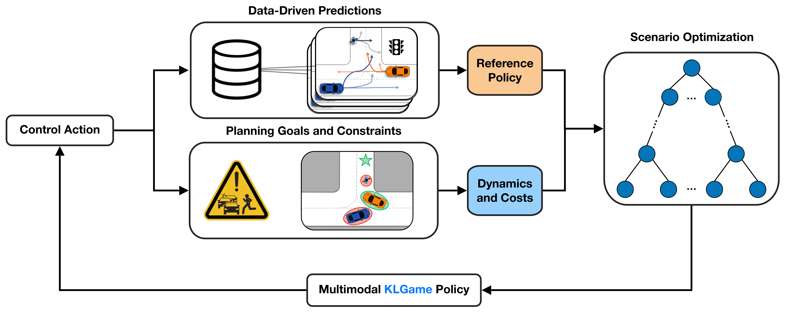
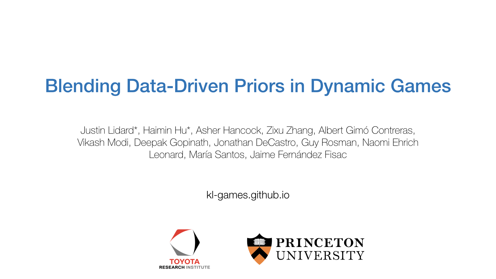
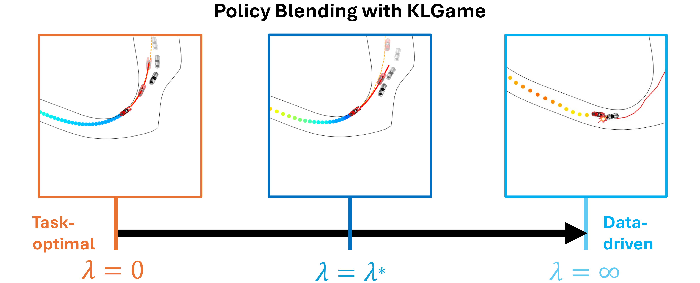

# Blending Data-Driven Priors in Dynamic Games

[![License][license-shield]][license-url]
[](https://www.python.org/downloads/)
[![Website][homepage-shield]][homepage-url]
[![Paper][paper-shield]][paper-url]

[Justin Lidard](https://jlidard.github.io/)<sup>1</sup>,
[Haimin Hu](https://haiminhu.org/)<sup>1</sup>,
[Asher Hancock](https://aasherh.github.io/)<sup>2</sup>,
[Zixu Zhang](https://zzx9636.github.io/)<sup>2</sup>,
[Albert Gimó Contreras](https://www.linkedin.com/in/albert-gim%C3%B3-contreras-a0894b25b/?originalSubdomain=es),
[Vikash Modi](https://www.linkedin.com/in/vikash-modi/),
[Jonathan DeCastro](https://jadecastro.github.io/),
[Deepak Gopinath](https://www.deepak-gopinath.com/),
[Guy Rosman](http://people.csail.mit.edu/rosman/),
[Naomi Ehrich Leonard](https://naomi.princeton.edu/),
[María Santos](https://mariasantos.me/),
[Jaime Fernández Fisac](https://saferobotics.princeton.edu/jaime)

<sup>1,2</sup>equal contribution

Published as a conference paper at RSS'2024.


<!-- PROJECT LOGO -->
<br />
<p align="center">
  <a href="https://github.com/SafeRoboticsLab/KLGame">
    
  </a>
  <p align="center">
  </p>
</p>


<!-- TABLE OF CONTENTS -->
<details open="open">
  <summary><h2 style="display: inline-block">Table of Contents</h2></summary>
  <ol>
    <li><a href="#about-the-project">About The Project</a></li>
    <li><a href="#examples">Examples</a></li>
    <li><a href="#license">License</a></li>
    <li><a href="#contact">Contact</a></li>
    <li><a href="#acknowledgements">Acknowledgements</a></li>
    <li><a href="#citation">Citation</a></li>
  </ol>
</details>


<!-- ABOUT THE PROJECT -->
## About The Project

This repository implements **KL Game**, an algorithm for solving non-cooperative dynamic game with Kullback-Leibler (KL) regularization with respect to a general, stochastic, and possibly multi-modal reference policy.
The repository is primarily developed and maintained by [Haimin Hu](https://haiminhu.org/), [Justin Lidard](https://jlidard.github.io/), and [Zixu Zhang](https://zzx9636.github.io/).

Click to watch our spotlight video:
[](https://haiminhu.org/wp-content/uploads/2024/06/rss_klgame.mp4)


## Examples
### Policy blending: car racing
We provide a car racing example in the [Notebook](https://github.com/SafeRoboticsLab/KLGame/blob/main/racing/example.ipynb) to showcase the *policy blending* feature of KL Game.
This Notebook comprises three sections, each dedicated to a closed-loop simulation using a different method: basic KL Game, multi-modal KL Game, and multi-modal reference policy.
<br />
<p align="center">
  <a href="https://github.com/SafeRoboticsLab/KLGame/blob/main/racing/example.ipynb">
    
  </a>
  <p align="center">
  </p>
</p>


<!-- LICENSE -->
## License

Distributed under the BSD 3-Clause License. See `LICENSE` for more information.


<!-- CONTACT -->
## Contact

- Justin Lidard - [@justinlidard](https://x.com/justinlidard) - jlidard@princeton.edu
- Haimin Hu - [@HaiminHu](https://x.com/HaiminHu) - haiminh@princeton.edu


## Acknowledgements
This research has been supported in part by an NSF Graduate Research Fellowship.
This work is partially supported by Toyota Research Institute (TRI).
It, however, reflects solely the opinions and conclusions of its authors and not TRI or any other Toyota entity.

<!-- PAPER -->
## Citation

If you found this repository helpful, please consider citing our paper.

```tex
@inproceedings{lidard2024blending,
  title={Blending Data-Driven Priors in Dynamic Games},
  author={Lidard, Justin and Hu, Haimin and Hancock, Asher and Zhang, Zixu and Contreras, Albert Gim{\'o} and Modi, Vikash and DeCastro, Jonathan and Gopinath, Deepak and Rosman, Guy and Leonard, Naomi and Santos, Mar{\'i}a and Fisac, Jaime Fern{\'a}ndez},
  booktitle={Proceedings of Robotics: Science and Systems},
  year={2024}
}
```


<!-- MARKDOWN LINKS & IMAGES -->
<!-- https://www.markdownguide.org/basic-syntax/#reference-style-links -->
[license-shield]: https://img.shields.io/badge/License-BSD%203--Clause-blue.svg
[license-url]: https://opensource.org/licenses/BSD-3-Clause
[homepage-shield]: https://img.shields.io/badge/-Website-orange
[homepage-url]: https://kl-games.github.io/
[paper-shield]: https://img.shields.io/badge/-Paper-green
[paper-url]: https://arxiv.org/pdf/2402.14174
